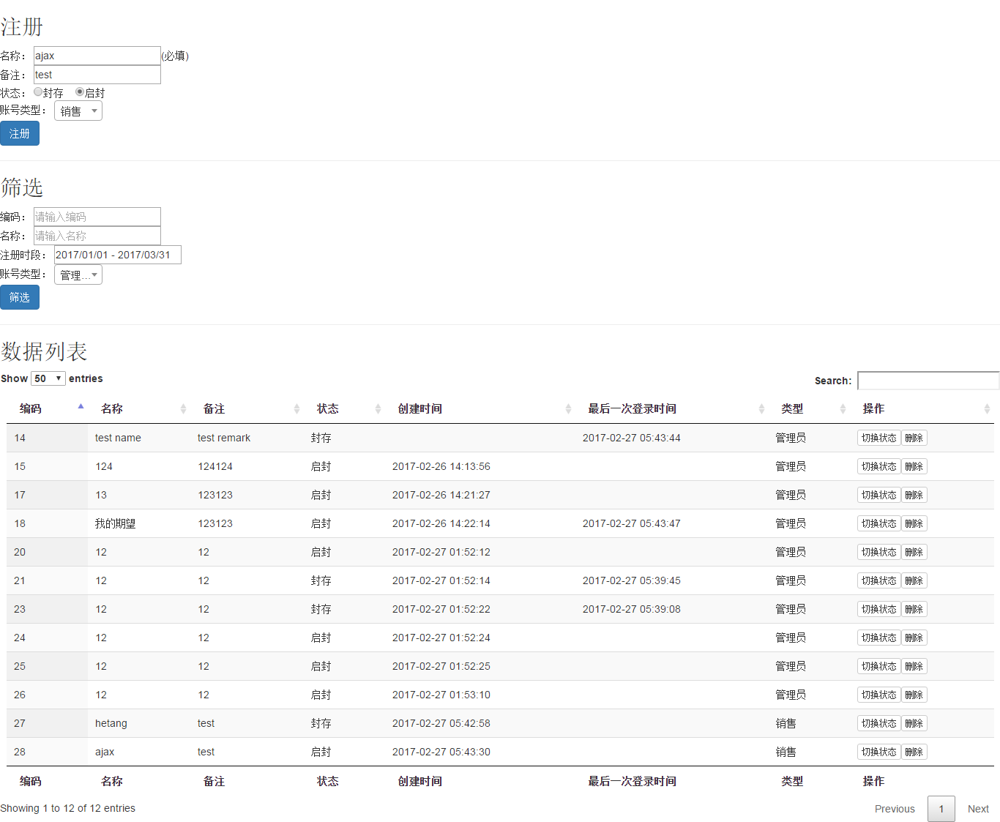

# account-manage
> 因为包名等原因，可能存在漏题风险，提交检阅后可能删除该仓库。

#### 简单说明

关于规范，快速实现，当然有的地方未严格按照规范，这个肯定根据团队来,我相信我的适应能力，这些都是灵活根据团队而改变、更新。

关于前端，简单实现，未完整设计用户交互等东西，仅仅将技术栈运用实现，题目给出的很多技术栈都是刚快速查看官方文档并快速实现，
肯定不是无可避免的不一定是最优解决方案，随着研究的深入肯定，优化肯定不是问题。

<font color="red">关于单元测试与集成测试</font>，这里仅仅测试了持久化层和接口，测试用例也是简单测试，提现技术点，根据项目会做严格的用例和测试的。
这是此次构建打包的结果，简单贴出来，如果做持续集成就不用看这些代码结果了，直接看持续集成的状态就行了。哈哈，这里简单贴一下，说明做过单元测试，确实再该代码的时候单元测试和集成测试提醒到一些有用的信息。
```html
Results :

Tests run: 14, Failures: 0, Errors: 0, Skipped: 0

[INFO]
[INFO] --- maven-jar-plugin:2.6:jar (default-jar) @ account-manage ---
[INFO] Building jar: D:\MyData\GitHub\account-manage\target\account-manage-0.0.1-SNAPSHOT.jar
[INFO]
[INFO] --- spring-boot-maven-plugin:1.5.1.RELEASE:repackage (default) @ account-manage ---
[INFO] ------------------------------------------------------------------------
[INFO] BUILD SUCCESS
[INFO] ------------------------------------------------------------------------
[INFO] Total time: 23.818 s
[INFO] Finished at: 2017-02-27T14:07:33+08:00
[INFO] Final Memory: 22M/261M
[INFO] ------------------------------------------------------------------------

```

时间有限，实现仓促，小实验仅体现快速实现、研究技术能力，如果用自己熟悉的技术栈肯定会更好，更快。

简单部署与服务器，<font color="red">不再加上持续集成、持续部署等功能</font>，

DEMO地址:[http://test.dxscx.com](http://test.dxscx.com)

#### **前端简单预览**



#### **原题目如下**：
```html
-[] 账户管理
- 账户基本属性：编码；名称，备注；状态；创建时间；最后登录时间;账号类型
- 账户基本操作：增加；删除；修改；查询；封存；启封
- 查询条件：编码(模糊匹配)；名称(模糊匹配)；注册时段(开始，结束时间)；账号类型
- 基本约束：编码不能相同，不能为空

- 技术栈
项目管理：maven
- 打包成spring-boot的embed jar形式(一个可以直接执行的jar包)
代码管理：git(@github)
前端：jquery+bootstrap
账号类型，用select2控件
注册时段，用daterangepicker
账号列表，使用datatables
状态，使用radiogroup
前后端通讯，采用ajax
后端：spring v4；mysql；freemarker
持久化，使用spring jdbc template(namedparameterjdbctemplate)
加分项：防止重复提交；nodejs+webpack/gulp
提交方式：提供github或者git.oschina.net的链接
```

#### **题目简单分析及思考**
> 说明：用`(--xxxxx)`的形式对分析进行备注

```html
-[] 账户管理 （--正常业务的理解，对数据库设计及实现的考察）
- 账户基本属性：编码(--可当主键)；名称，备注；状态；创建时间；最后登录时间;账号类型
- 账户基本操作：增加；删除；修改；查询；封存；启封（--这里体现了状态属性的几个基本数据项）
- 查询条件：编码(模糊匹配)；名称(模糊匹配)；注册时段(开始，结束时间)；账号类型（--可以考虑在查询项建立索引，仅仅是考虑，根据业务需求来考量是否需要）
- 基本约束：编码不能相同，不能为空（--建立唯一约束和非空约束）

- 技术栈
项目管理：maven （--以前用maven,现在更多用gradle）
- 打包成spring-boot的embed jar形式(一个可以直接执行的jar包)(--springboot的一个优势，内嵌tomcat的fat jar,有方便部署等优势)
代码管理：git(@github)（--现在团队协作比较好的版本管理工具）
前端：jquery+bootstrap（--构建页面用和对dom进行操作，不过要写很多代码，要是准许用另外的框架我会用vue来做前端的数据，操作更灵活）
账号类型，用select2控件（--没用过，不过应该不是一个选择空间，查看下官方api）
注册时段，用daterangepicker(--没用过，应该是一个时间选择器，目前的需求能在前端搜索是用得到)
账号列表，使用datatables（--没用过，查一下）
状态，使用radiogroup（--没用过，查一下）
前后端通讯，采用ajax（--通讯方式，看题目应该是用jquery的ajax了，如果用vue会用vue resource或则另外的ajax通讯框架）
后端：spring v4；mysql；freemarker（--spring v4，这里没说到不知道该不该用SpringMVC，mysql好久没用，实习一直用的postgres,这里应该问题不大，freemaker没用过，一种模板技术，应该是和其他差不了多少。）
持久化，使用spring jdbc template(namedparameterjdbctemplate)（--没用过，以前看soring官方文档看到过，更多时候用JPA,这里我猜测不让用ORM工具主要是考察写SQL吧，不然我会用ORM写代码更快，这里也没说连接池问题，这个技术栈呢？）
加分项：防止重复提交；nodejs+webpack/gulp（--防重准备在前端简单做一下防重，请求未返回或者超时时间内会置灰相关按钮，对于nodejs和webpack等等一些这里也就不做了，这些工具知识了解和简单使用就不再弄了）
提交方式：提供github或者git.oschina.net的链接（--这里选用github就行）
```

#### **数据库表设计**

**设计简单说明：**

这里长度根据业务来设置，这里仅根据自己理解和认识设一般情况下的值

状态编码可以由数字进行编码如：0-封存，1-启封，2- ，3- 等等，也可以使用字符串varchar进行编码，在code或者引用中看到具体值(比如‘封存’而不是0-1-2的数字)时就不用再查编码表，但是磁盘消耗更多一些，一般情况可以忽略
这里用2个字进行编码（目前发现的有：启封，封存两个状态，或者默认这是一个值什么的，都可以定）

账号类型也用字符串来编码，优势和状态编码一样，还有好处是在身份显示时，前端无需再转换（如果是可以直接给用户类型刚好可以直接显示的话），这种编码的缺点还有一个就是在网络传输时会增大传输，如果QPS要求高的全部能省则省，改为数字编码即可。

表名 tb_account_management

| 属性 | 数据类型 | 长度 | 可空约束 | 其他约束 | 备注说明  |
|:----|:--------:|:-----:|:----:|:----:|:--------------|
| serial_number | int | - | false | 唯一 | 编码 |
| name | varchar | 20 | false | 无 | 名称 |
| remark | varchar | 50 | true | 无 | 备注 |
| status | varchar | 4 | false | 无 | 状态 |
| create_on | timestamp | - | false | 无 | 创建时间 |
| last_login_time | timestamp | - | false | 无 |最后登录时间 |
| type | varchar | 10 | false | 无 | 账号类型 |

数据库创建sql
```sql
DROP TABLE IF EXISTS `tb_account_management`;
CREATE TABLE `tb_account_management` (
  `serial_number` int(11) NOT NULL AUTO_INCREMENT,
  `name` varchar(20) DEFAULT NULL,
  `remark` varchar(50) DEFAULT NULL,
  `status` varchar(4) DEFAULT NULL,
  `create_on` timestamp NULL DEFAULT NULL,
  `last_login_time` timestamp NULL DEFAULT NULL ON UPDATE CURRENT_TIMESTAMP,
  `type` varchar(10) DEFAULT NULL,
  PRIMARY KEY (`serial_number`)
) ENGINE=InnoDB AUTO_INCREMENT=1 DEFAULT CHARSET=utf8mb4;
```


#### 说好的不能用的框架？
json序列化不知道需不需要自己写
连接池不知道是不是需要自己写

#### 一些疑问

1. DataTables

查看了DataTables官方文档，发现其ajax数据是采用对应列进行数据绑定，感受到DataTables带来的强大好处是`不用自己分页，
快速查询，排序等等已有的常用功能`,但有没有一点太死板的感觉？至少在不定制DataTables前有这种感觉，必须将数据和前端显示的
view一一对应起来（data关键字包含起来的一个数组），同样一块数据，专门为DataTables做了数据格式，不易于其他平台使用，不过好处还是很明显的。

随着慢慢看官方文档，还是有很多可以控制的地方。

2. 登录
登录是什么回事？这里处理的是只要修改账户管理视为登录。

3. RadioGroup

这个技术点没有太难的地方，以前做安卓也用到过，就是"单选组"，以前也就用radio来做单选，查了一下文档，radioGroup怎么应用起来没反应?不知道为什么

这是w3c的源代码，放在网页里没反应。

```html
<menu>
    <command onclick="alert('Hello World')" type="radio" radiogroup="group1">Click Me!</command>
    <command onclick="alert('Good morning!')">Click This!</command>
    <command onclick="alert('Good day!')" type="radio" radiogroup="group1">And this!</command>
</menu>
```
这里先用radio实现一下，也许是浏览器兼容问题，我用chorme和360都试过了。


#### 如果你看到了这里，谢谢你，已经看完了。。。。